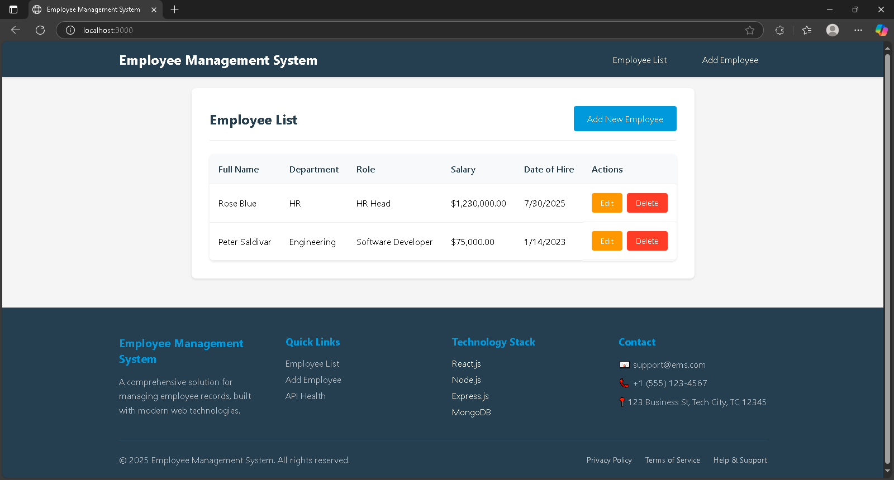

# Employee Management System

A full-stack web application built with the MERN stack (MongoDB, Express.js, React, Node.js) for managing employee records with CRUD operations.

## Screenshot



*Employee Management System - Main Dashboard*

## Features

- **Create, Read, Update, Delete (CRUD)** employee records
- **Responsive design** that works on desktop and mobile devices
- **Form validation** with real-time error feedback
- **Modern UI** with clean and intuitive interface
- **RESTful API** with proper error handling
- **MongoDB integration** for data persistence

## Employee Fields

Each employee record includes:
- **Full Name** (String, required)
- **Department** (String, required)
- **Role/Position** (String, required)
- **Salary** (Number, required, positive value)
- **Date of Hire** (Date, required)

## Tech Stack

### Backend
- **Node.js** - JavaScript runtime
- **Express.js** - Web framework
- **MongoDB** - NoSQL database
- **Mongoose** - MongoDB object modeling
- **CORS** - Cross-origin resource sharing
- **Helmet** - Security middleware
- **Morgan** - HTTP request logger

### Frontend
- **React** - JavaScript library for building user interfaces
- **React Router** - Client-side routing
- **Axios** - HTTP client for API calls
- **CSS3** - Styling with modern CSS features

## Project Structure

```
employee-management-system/
├── server/                 # Backend files
│   ├── index.js           # Main server file
│   ├── models/            # Database models
│   │   └── Employee.js    # Employee schema
│   └── routes/            # API routes
│       └── employees.js   # Employee CRUD routes
├── client/                # Frontend files
│   ├── public/            # Static files
│   │   └── index.html     # Main HTML file
│   └── src/               # React source code
│       ├── components/    # React components
│       │   ├── Navbar.js
│       │   ├── EmployeeList.js
│       │   ├── AddEmployee.js
│       │   └── EditEmployee.js
│       ├── services/      # API services
│       │   └── api.js     # Axios configuration
│       ├── App.js         # Main React component
│       ├── App.css        # Main styles
│       ├── index.js       # React entry point
│       └── index.css      # Global styles
├── package.json           # Root package.json
└── README.md             # Project documentation
```

## Prerequisites

Before running this application, make sure you have the following installed:

- **Node.js** (v14 or higher)
- **npm** (comes with Node.js)
- **MongoDB** (local installation or MongoDB Atlas account)

## Installation & Setup

### 1. Clone the repository
```bash
git clone <repository-url>
cd employee-management-system
```

### 2. Install dependencies
```bash
# Install backend dependencies
npm install

# Install frontend dependencies
cd client
npm install
cd ..
```

### 3. Set up environment variables
Create a `.env` file in the root directory:
```env
PORT=5000
MONGODB_URI=mongodb://localhost:27017/employee-management
NODE_ENV=development
```

**Note:** If you're using MongoDB Atlas, replace the MONGODB_URI with your connection string.

### 4. Start MongoDB
Make sure MongoDB is running on your system:
```bash
# On Windows
mongod

# On macOS/Linux
sudo systemctl start mongod
```

### 5. Run the application

#### Development mode (both frontend and backend)
```bash
npm run dev
```

#### Backend only
```bash
npm run server
```

#### Frontend only
```bash
npm run client
```

The application will be available at:
- **Frontend**: http://localhost:3000
- **Backend API**: http://localhost:5000

## API Endpoints

### Employee Management

| Method | Endpoint | Description |
|--------|----------|-------------|
| GET | `/api/employees` | Get all employees |
| POST | `/api/employees` | Create new employee |
| GET | `/api/employees/:id` | Get employee by ID |
| PUT | `/api/employees/:id` | Update employee |
| DELETE | `/api/employees/:id` | Delete employee |

### Health Check
| Method | Endpoint | Description |
|--------|----------|-------------|
| GET | `/api/health` | API health status |

## Usage

### Adding an Employee
1. Navigate to the "Add Employee" page
2. Fill in all required fields:
   - Full Name
   - Department
   - Role/Position
   - Salary (positive number)
   - Date of Hire
3. Click "Add Employee" to save

### Viewing Employees
- The main page displays all employees in a table format
- Employees are sorted by creation date (newest first)
- Salary is displayed in USD currency format
- Date of hire is displayed in local date format

### Editing an Employee
1. Click the "Edit" button next to any employee
2. Modify the desired fields
3. Click "Update Employee" to save changes

### Deleting an Employee
1. Click the "Delete" button next to any employee
2. Confirm the deletion in the modal dialog
3. The employee will be permanently removed

## Form Validation

The application includes comprehensive form validation:

- **Required fields**: All fields are mandatory
- **Salary validation**: Must be a positive number
- **Date validation**: Date of hire must be a valid date
- **Real-time feedback**: Errors are displayed as you type
- **Server-side validation**: Additional validation on the backend

## Error Handling

The application includes robust error handling:

- **Network errors**: Displays user-friendly error messages
- **Validation errors**: Shows specific field validation messages
- **Server errors**: Graceful handling of API failures
- **404 errors**: Proper handling of invalid routes

## Contributing

1. Fork the repository
2. Create a feature branch (`git checkout -b feature/amazing-feature`)
3. Commit your changes (`git commit -m 'Add some amazing feature'`)
4. Push to the branch (`git push origin feature/amazing-feature`)
5. Open a Pull Request

## License

This project is licensed under the MIT License - see the LICENSE file for details.

## Support

If you encounter any issues or have questions:

1. Check the console for error messages
2. Ensure MongoDB is running
3. Verify all environment variables are set correctly
4. Check that all dependencies are installed

## Future Enhancements

Potential improvements for future versions:

- User authentication and authorization
- Advanced search and filtering
- Export functionality (PDF, Excel)
- Employee photo upload
- Department management
- Salary analytics and reporting
- Email notifications
- Bulk import/export operations 